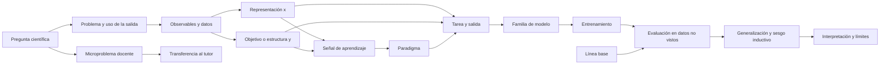

# S01 — Qué intentamos responder cuando tenemos datos

Este paquete lleva al repo la arquitectura de contenido que se debe convertir en la primera página del curso. La nota de Obsidian indicada en `source_note` contiene el guion pedagógico completo, las preguntas para el tablero y la trazabilidad detallada. El paquete organiza la implementación posterior y mantiene separadas la preparación teórica, la página final y los notebooks.

## Propósito

Construir un mapa común para que los tutores puedan comenzar por la pregunta científica y avanzar hacia una formulación de ML: qué queremos obtener de los datos, qué señal de aprendizaje está disponible, qué tarea se plantea, qué familias de modelos pueden servir y cómo se juzga la salida.

## Alcance

La sesión dura entre 60 y 90 minutos y es teórica. Usa microproblemas astronómicos cerrados para aterrizar cada discusión. No abre datasets, no entrena modelos y no produce resultados científicos.

### Producto de la sesión

- una secuencia de tablero que pueda transcribirse a la página web;
- un vocabulario inicial para distinguir pregunta, datos, señal, paradigma, tarea, familia y evaluación;
- un árbol conceptual provisional, construido durante la conversación;
- una respuesta de salida que formule un problema astronómico como tarea de ML;
- una lista de conceptos que pasan a formalización en S02.

### Mensaje núcleo

ML estudia cómo construir y evaluar modelos que aprendan de datos para producir una salida definida sobre instancias nuevas. La pregunta científica, la naturaleza de los datos, la señal disponible y el uso de la salida determinan la formulación.

## Prioridad bibliográfica de esta versión

El capítulo 1 de Géron es la columna vertebral del guion: definición de ML, motivos para usarlo, aplicaciones, supervisión, aprendizaje por lotes/en línea, aprendizaje basado en instancias/modelos, flujo de proyecto, desafíos de datos, overfitting, underfitting, regularización y evaluación. Kelleher, capítulo 1, complementa con datos → insight → decisión, características descriptivas y objetivo, el carácter mal planteado del aprendizaje, generalización, sesgo inductivo y CRISP-DM.

Los ejemplos del capítulo se traducen a astronomía: spam → clasificación de candidatos en curvas de luz; precio de automóvil → radio, temperatura o abundancia; grupos de visitantes → familias de espectros; fraude → anomalías instrumentales; robot/Go → selección secuencial de observaciones; fotografías web frente a fotografías del teléfono → simulaciones frente a observaciones reales. El guion conserva la función conceptual de cada ejemplo y cambia el dominio explícitamente.

La nota canónica incorpora cuatro ilustraciones SVG originales junto al archivo de sesión: comparación reglas/ML, dos pasos del aprendizaje supervisado, modelos compatibles y ajuste/generalización. Son material interno editable para la futura producción; las figuras de los libros funcionan como referencia conceptual y no se copian.

## Guion docente desarrollado

La guía canónica de Obsidian contiene ahora una narración completa bajo el encabezado `Guion narrativo para impartir la sesión`. Esa sección está escrita para que el docente pueda leerla, resumirla o adaptarla mientras conserva el orden conceptual. El repositorio recibe este resumen de handoff para que la producción digital conozca qué contenido debe preservar y qué partes todavía son internas.

### Apertura que debe conservarse

La clase empieza con la trayectoria de Kelleher:

```text
datos → insight → decisión
```

El docente presenta cinco preguntas antes de nombrar algoritmos: ¿qué valor desconocido queremos asignar?, ¿cómo están organizados los datos?, ¿qué relación o incertidumbre queremos estimar?, ¿qué acción conviene tomar? y ¿qué nuevas instancias queremos producir? Los ejemplos astronómicos son cerrados y orales: abundancia a partir de un espectro, familias en un catálogo sin etiquetas, incertidumbre de una relación, siguiente observación y espectros sintéticos. Cada ejemplo debe responder entrada, salida, señal disponible y evidencia de utilidad.

Después se introducen tres vocabularios para una misma situación. IA nombra el campo o sistema capaz de percibir, representar, razonar, aprender, decidir o generar; estadística organiza la descripción de distribuciones, relaciones, variabilidad, incertidumbre y evidencia; ML describe métodos que ajustan modelos o representaciones a partir de experiencia para producir salidas en instancias nuevas, descubrir estructura o apoyar decisiones. La relación entre los tres términos se presenta mediante el ejemplo de estimar una abundancia desde un espectro.

La definición operativa de Géron se conserva completa: hay aprendizaje cuando el desempeño en una tarea, medido por una medida de desempeño, mejora con la experiencia. Kelleher aporta la formulación de la instancia, la representación, el objetivo y el uso de la salida dentro de la trayectoria datos → insight → decisión. El tablero debe llegar a:

```text
instancia → representación x → objetivo y → modelo hθ → salida ŷ
```

La sesión deriva supervisado, no supervisado y refuerzo desde la señal disponible: objetivos por instancia; estructura sin objetivo; o estados, acciones, consecuencias y recompensas. Luego separa paradigma, tarea y familia de modelo. Regresión, clasificación, clustering y generación describen salidas; árboles, vecinos, modelos probabilísticos, ensambles y redes describen familias. Deep learning se ubica dentro de las familias de redes y puede emplearse en distintas tareas.

La segunda mitad explica que la unidad de análisis, la representación, el ruido, el tipo de variable, la disponibilidad temporal, la selección observacional y el dominio cambian el problema. El cierre presenta ajuste, generalización, underfitting, overfitting, sesgo inductivo, particiones, métricas, línea base, cambio de dominio y límites de interpretación. La frase final que debe quedar en la página es:

```text
pregunta → unidad de análisis → representación y datos → señal de aprendizaje
→ tarea → familia de modelo → evaluación → interpretación y límites
```

### Nivel de desarrollo esperado

La página web no debe convertir esta sesión en una lista de definiciones. Debe conservar, en una primera versión, el texto explicativo, las preguntas que activan cada transición, las respuestas esperadas y los microproblemas cerrados. La captura del tablero debe mostrar cómo se construye el árbol durante la conversación; el árbol final será una depuración posterior para la interfaz. Datasets, notebooks, cálculo de métricas y demostraciones quedan fuera de S01.

## Secuencia de 60–90 minutos

| Momento | Tiempo | Qué se comunica |
| --- | ---: | --- |
| 1. Preguntas que hacemos con datos | 10–12 min | Predicción, estructura, estimación, decisión y generación como salidas posibles |
| 2. IA, estadística y ML | 10–12 min | Tres vocabularios que describen aspectos relacionados de una solución |
| 3. Qué significa aprender | 10–12 min | Datos, representación, objetivo, modelo, tarea, experiencia y desempeño |
| 4. Tres paradigmas | 12–15 min | Supervisado, no supervisado y por refuerzo según la señal disponible |
| 5. Tareas y familias | 12–15 min | Regresión, clasificación, clustering y generación; redes profundas como familia |
| 6. Naturaleza de los datos | 5–8 min | Etiquetas, ruido, representación, dimensión, secuencia y cambio de dominio |
| 7. Generalización y evaluación | 8–10 min | Ajuste, datos no vistos, métricas, líneas base y límites |
| 8. Síntesis y quiz | 8–12 min | Reconstrucción del árbol y diagnóstico de misconceptions |

Si el encuentro dura una hora, se conservan los bloques 1–5 y 7–8 con un microproblema por bloque. Si dura hora y media, se mantienen las preguntas de tablero, los ejemplos cerrados y el quiz completo.

## Materiales

- pizarra inicialmente limpia, con la pregunta «¿qué queremos responder con los datos?»;
- tarjetas o notas para las cinco salidas iniciales: predecir, describir estructura, estimar/inferir, decidir y generar;
- cinco microproblemas astronómicos breves, formulados sin vocabulario técnico;
- mapa existente del vault como referencia visual para incorporar familias y métodos por capas;
- tabla de microproblemas astronómicos cerrados;
- pregunta de salida y quiz de misconceptions;
- cámara o procedimiento de transcripción para conservar cada estado del tablero;
- la sesión funciona con tablero y microproblemas; el dataset y el notebook quedan para una sesión posterior.

El mapa existente se presenta después de que el grupo haya construido las primeras relaciones. Su función es ampliar el paisaje de métodos y referencias; la clase conserva como estructura organizadora la cadena pregunta → datos → señal → tarea → familia → evaluación.

## Guion de comunicación

### 0. Apertura: qué intentamos responder cuando tenemos datos

Abrir con la trayectoria de Kelleher:

```text
datos → insight → decisión
```

Decir:

> Hoy vamos a construir el mapa desde la pregunta inicial. Antes de nombrar algoritmos, necesitamos precisar qué queremos conocer o producir con los datos y qué uso tendrá esa salida.

Escribir cinco tarjetas:

1. ¿Queremos asignar un valor o una clase a una instancia nueva?
2. ¿Queremos comprender cómo se distribuyen u organizan las instancias?
3. ¿Queremos estimar una relación, un parámetro o una incertidumbre?
4. ¿Queremos elegir una acción o priorizar una observación?
5. ¿Queremos producir nuevas instancias o reconstrucciones compatibles con los datos?

Conectar cada tarjeta con un problema astronómico cerrado:

- espectro → abundancia o temperatura;
- catálogo sin etiquetas → grupos o casos raros;
- señal → relación y rango de incertidumbre;
- planificación de observaciones → siguiente acción;
- distribución de espectros → muestras sintéticas o reconstrucciones.

Preguntar en cada caso:

- ¿qué unidad estamos estudiando: fuente, visita, espectro, imagen, curva de luz o segmento?
- ¿qué recibe el sistema?
- ¿qué debería producir?
- ¿qué información o señal tiene para aprender?
- ¿cómo sabríamos si la salida es útil para la pregunta?

Registrar primero las respuestas en lenguaje común. Kelleher llama predicción a asignar un valor a una variable desconocida, de modo que una clase, una abundancia o un parámetro también pueden ser predicciones aunque no hablen del futuro.

Solo después introducir que supervisado/no supervisado/refuerzo describen la señal; regresión/clasificación/agrupamiento/generación describen tareas o salidas; árboles, ensambles, vecinos, modelos probabilísticos, SVM y redes describen familias o mecanismos. Deep learning se ubica dentro de las familias de redes neuronales.

Mostrar el mapa del vault como panorama después de esta discusión. Su función es ampliar el paisaje de métodos, tareas, arquitecturas y referencias. La clase agrega la cadena que lo organiza:

```text
pregunta y uso → datos/representación → señal → paradigma → tarea/salida
→ familia → entrenamiento → evaluación → interpretación y límites
```

Los nodos del mapa se incorporan al tablero a medida que la conversación los necesita. Cada etapa debe fotografiarse o transcribirse para que la página web conserve tanto el resultado como el proceso de construcción.

### 1. IA, ML y métodos estadísticos

Las definiciones de IA y estadística que siguen son una síntesis didáctica del curso. Géron y Kelleher sostienen directamente la parte de ML, analítica predictiva, modelos, datos, desempeño y generalización; la bibliografía específica de IA y estadística se ampliará después.

Definiciones de trabajo:

- **IA:** campo amplio de sistemas y capacidades asociados con percibir, representar, razonar, predecir, decidir, actuar o generar resultados.
- **ML:** métodos que ajustan una representación o un modelo usando datos para producir salidas en instancias nuevas, descubrir estructura o apoyar decisiones.
- **Métodos estadísticos:** herramientas para describir distribuciones, estimar relaciones y parámetros, cuantificar incertidumbre y evaluar evidencia bajo supuestos explícitos.

Decir:

> Una misma solución puede describirse con los tres vocabularios. IA enfatiza la capacidad o el sistema; ML, cómo se ajusta a partir de datos; estadística, cómo modelamos relaciones, variabilidad e incertidumbre.

**Microproblema:** queremos estimar la abundancia de una molécula a partir de un espectro.

- ML: aprender una relación entre la representación del espectro y la abundancia objetivo para responder en un espectro nuevo.
- Estadística: modelar la relación, expresar error o incertidumbre y revisar los supuestos de la estimación.
- IA: integrar la percepción de la señal y la salida en un sistema que apoya una tarea o decisión.

Reparar tres misconceptions: IA puede usar reglas, búsqueda o modelos estadísticos; ML incluye árboles, vecinos, modelos probabilísticos y redes; la incertidumbre, la variabilidad y la calidad de la evidencia siguen siendo parte del análisis.

### 2. El ciclo mínimo de ML

Introducir una tabla supervisada:

```text
x_i = representación de una observación
y_i = objetivo o etiqueta disponible
D   = conjunto de instancias {(x_i, y_i)}
ŷ   = hθ(x), salida del modelo para una instancia nueva
```

Explicar:

- `x` representa la observación mediante las variables o estructuras que decidimos ofrecer;
- `y` es un objetivo medido o etiquetado, con sus propios sesgos;
- el modelo ajustado es una representación aprendida con un alcance definido;
- `ŷ` es una salida estimada cuyo significado depende de la tarea, la evidencia y el uso.

Añadir la unidad de análisis de Kelleher: cada instancia debe corresponder a un sujeto de predicción reconocible —una fuente, una visita, un espectro, una imagen, una curva de luz o un segmento temporal—. La representación puede contener variables numéricas, categóricas, intervalos, secuencias, texto, imágenes o rasgos derivados. La información disponible antes de producir la etiqueta o tomar la decisión determina qué variables son válidas.

Usar la formulación de Géron: hay aprendizaje cuando el desempeño en una tarea, medido por una medida de desempeño, mejora con la experiencia. Añadir la formulación de Kelleher: el modelo induce una relación entre variables descriptivas y un objetivo usando instancias históricas, dentro de una trayectoria datos → insight → decisión.

**Microproblema:** tenemos espectros sintéticos con parámetros conocidos y un espectro nuevo sin esos parámetros. Preguntar qué serían `x`, `y`, la instancia de entrenamiento y la salida nueva.

Precisar que “predecir” puede significar asignar un valor desconocido: clasificar un candidato o estimar una abundancia no tiene que referirse al futuro. Tampoco equivale a causalidad.

### 3. Tres paradigmas tradicionales

| Paradigma | Señal de aprendizaje | Tareas frecuentes | Viñeta astronómica |
| --- | --- | --- | --- |
| Supervisado | Cada instancia tiene objetivo/etiqueta | Regresión, clasificación | Espectro → abundancia o clase |
| No supervisado | No se entrega objetivo por instancia | Agrupamiento, representación, anomalías | Catálogo sin etiquetas → estructura o rarezas |
| Por refuerzo | Agente, acciones, recompensa e interacción | Control, secuenciación, política | Telescopio que elige una observación de seguimiento |

Decir:

> Estas tres cajas organizan la señal de aprendizaje. No son una clasificación exhaustiva de todos los métodos ni están al mismo nivel que regresión, árboles o deep learning.

#### Supervisado

Si existen objetivos por instancia, se puede aprender una relación entrada → salida. Lo decisivo es la etiqueta o el objetivo disponible, no que se use una red.

#### No supervisado

La ausencia de etiquetas deja abierta la pregunta científica y cambia la forma de expresar y evaluar la salida. Se pueden buscar estructura, compresión, representación o anomalías; la interpretación física de un grupo requiere evidencia adicional.

#### Por refuerzo

El aprendizaje por refuerzo se define mediante estados, acciones posibles, recompensas e interacción; con estos elementos el agente mejora una política a lo largo del tiempo.

#### Refinamientos

- semisupervisado: pocas instancias etiquetadas y muchas sin etiqueta;
- autosupervisado: el dato permite fabricar un objetivo auxiliar;
- batch/online: actualización con todo el conjunto o de forma incremental;
- instance-based/model-based: comparar con instancias o construir un modelo explícito.

Estos criterios pueden combinarse. Una red profunda puede ser supervisada, autosupervisada o usar refuerzo.

### 4. Tarea, familia de modelo y deep learning

Incorporar sobre la pizarra los nodos pertinentes del mapa de referencia, sin convertirlo en una lista exhaustiva:

```text
paradigma → tarea/salida → familia de modelo → entrenamiento → evaluación
```

| Tarea | Salida | Ejemplo |
| --- | --- | --- |
| Regresión | Número o vector continuo | Temperatura, abundancia o radio |
| Clasificación | Clase o probabilidad | Categoría de candidato |
| Agrupamiento | Grupos inducidos | Familias de espectros |
| Generación | Muestras, reconstrucciones o datos condicionados | Espectros sintéticos o completamiento de una señal |
| Reducción/representación | Coordenadas compactas | Resumen de espectro o imagen |
| Anomalía | Señal de rareza | Objeto fuera del conjunto de referencia |

Para cada tarea repetir la misma dinámica: pregunta → salida → datos → familia posible → evaluación → pregunta astronómica.

#### Regresión

- **Pregunta:** ¿qué valor continuo corresponde a la instancia?
- **Salida:** número o vector continuo.
- **Datos:** espectros, imágenes, curvas de luz o características tabulares con objetivos conocidos.
- **Ejemplos:** temperatura, radio, masa, abundancia o parámetros atmosféricos.
- **Familias posibles:** lineales, polinomiales, árboles/ensambles, SVM de regresión y redes.
- **Evaluación:** MAE, MSE/RMSE, error relativo, calibración e incertidumbre.
- **Pregunta de tablero:** ¿qué error tiene relevancia científica y qué resolución posee el objetivo?

#### Clasificación

- **Pregunta:** ¿a qué clase o conjunto de clases pertenece la instancia?
- **Salida:** clase, probabilidad o varias etiquetas.
- **Datos:** imágenes, espectros, curvas de luz o variables tabulares etiquetadas.
- **Ejemplos:** candidato planetario/falso positivo, tipo espectral, morfología o presencia de una señal.
- **Familias posibles:** logística, árboles/ensambles, KNN, SVM y redes.
- **Evaluación:** matriz de confusión, precisión, recall, F1, ROC-AUC, calibración y costo de errores.
- **Pregunta de tablero:** ¿qué error importa más: descartar un objeto interesante o priorizar un falso positivo?

#### Clustering

- **Pregunta:** ¿qué grupos o regiones de similitud aparecen?
- **Salida:** asignaciones de grupo, centroides, jerarquías o estructura de similitud.
- **Datos:** instancias sin etiquetas, con una representación comparable y una noción explícita de distancia o densidad.
- **Ejemplos:** familias de espectros, grupos de curvas de luz o poblaciones observacionales.
- **Familias posibles:** k-means, jerárquico, DBSCAN y mezclas probabilísticas.
- **Evaluación:** coherencia interna, estabilidad, comparación con conocimiento externo y utilidad científica.
- **Pregunta de tablero:** ¿la similitud elegida representa la propiedad astronómica que interesa?

#### Generación

- **Pregunta:** ¿qué distribución queremos modelar y qué nuevas instancias o reconstrucciones son útiles?
- **Salida:** muestras nuevas, reconstrucciones, completamientos o datos condicionados.
- **Datos:** una colección de referencia y criterios de realismo, cobertura y consistencia física.
- **Ejemplos:** espectros sintéticos condicionados por temperatura/composición, imágenes simuladas o reconstrucción de una señal incompleta.
- **Familias posibles:** modelos probabilísticos, autoencoders/VAE, GAN y difusión.
- **Evaluación:** distribución, diversidad, cobertura, reconstrucción, consistencia física y utilidad en una tarea posterior.
- **Pregunta de tablero:** ¿qué propiedad debe conservar la muestra sintética para apoyar una afirmación científica?

Familias que se mostrarán como mapa, no como lista cerrada:

- información: árboles y reglas;
- similitud: vecinos y métodos relacionados;
- probabilidad: modelos probabilísticos y Bayes;
- error: regresión, clasificación y optimización;
- lineales, árboles/ensambles, SVM, probabilísticos y redes neuronales como vocabulario práctico.

Para incorporar la lectura de Kelleher, añadir una segunda agrupación de familias:

| Familia de aprendizaje | Pregunta que guía el ajuste | Ejemplos |
| --- | --- | --- |
| Basada en información | ¿Qué partición o regla reduce la incertidumbre? | árboles y ganancia de información |
| Basada en similitud | ¿Qué instancias conocidas se parecen a la nueva? | vecinos y distancias |
| Basada en probabilidad | ¿Qué distribución o probabilidad permite inferir la salida? | Bayes y modelos probabilísticos |
| Basada en error | ¿Qué parámetros reducen la discrepancia entre salida y objetivo? | regresión y descenso de gradiente |

Esta segunda agrupación aparece como una vista teórica del árbol. El mapa existente puede conservar sus nombres de algoritmos y arquitecturas en otra capa.

Deep learning ocupa la familia de redes neuronales con múltiples capas. Puede resolver tareas supervisadas, autosupervisadas o de refuerzo, y por eso aparece conectado con varias ramas del árbol.

Advertencia de Géron: la profundidad no elimina la necesidad de fundamentos, datos adecuados, capacidad de cómputo, regularización, línea base y evaluación.

**Microproblema:** con el mismo espectro queremos estimar temperatura o clasificar una atmósfera. Preguntar qué cambia: salida, tarea y métrica. Preguntar después qué no queda decidido: la familia de modelo.

### 5. La naturaleza de los datos cambia la formulación

Presentar una tabla breve y volver a usar el ejemplo de espectros sintéticos frente a observados:

| Condición | Pregunta para el tutor | Efecto sobre el problema |
| --- | --- | --- |
| Hay etiquetas por instancia | ¿Qué objetivo fue medido y con qué error? | Permite una formulación supervisada |
| Las instancias no tienen etiquetas | ¿Qué estructura, densidad o rareza buscamos? | Lleva a tareas no supervisadas |
| Hay secuencia temporal o espacial | ¿Las filas son intercambiables? | Cambia representación y partición |
| Hay ruido, faltantes o sesgos de medición | ¿Qué parte del patrón pertenece al instrumento? | Afecta entrenamiento y evaluación |
| Hay datos sintéticos y observados | ¿La distribución de entrenamiento representa el uso? | Puede producir cambio de dominio |
| Hay pocas instancias y muchas variables | ¿Qué restricciones y línea base son razonables? | Aumenta el riesgo de sobreajuste |

Microproblema: un modelo rinde muy bien con espectros sintéticos y falla con observados. Pedir hipótesis sobre ruido, resolución, representación, partición, etiquetas y métrica. La discusión permanece teórica y prepara la generalización.

### 6. Generalización, línea base y límites

Comunicar en este orden:

1. Un ajuste excelente en entrenamiento puede fallar en instancias nuevas.
2. Kelleher presenta ML como problema mal planteado: varios modelos pueden ser compatibles con una muestra finita.
3. El sesgo inductivo —representación, familia, restricciones, preferencias y regularización— ayuda a escoger, pero también puede fallar.
4. Sobreajuste y subajuste son fallas de generalización.
5. La evaluación debe usar datos no empleados para ajustar y una métrica coherente con el uso.

Escribir:

```text
entrenamiento ≠ evidencia suficiente
buena predicción ≠ explicación causal o física
mejor métrica ≠ mejor modelo sin contexto de uso
```

Introducir la evaluación como experimento:

- **hold-out:** reservar instancias que no participan en el ajuste;
- **validación cruzada:** repetir la separación en varios pliegues cuando una sola partición puede ser inestable;
- **separación temporal o por objeto:** mantener fuera de entrenamiento épocas, fuentes o grupos completos cuando las instancias comparten información.

Géron usa `X`, `y`, `h` y `ŷ` para mostrar la relación entre representación, objetivo, función de predicción y salida. Kelleher insiste en que la métrica debe alinearse con la tarea y con el uso de la salida. Para S01 basta con distinguir entrenamiento, validación y prueba; las fórmulas y los diseños detallados pasan a sesiones posteriores.

**Microproblema:** un modelo funciona muy bien con espectros sintéticos, pero falla en espectros observados ruidosos. No pedir una solución; pedir hipótesis: dominio no representativo, representación/preprocesamiento frágil, partición inadecuada, métrica equivocada o cambio de dominio.

### 7. Integración y cierre

Usar dos viñetas finales breves:

- espectros de atmósferas de exoplanetas: datos → objetivo → tarea supervisada;
- representaciones/anomalías: datos sin etiqueta → estructura o rareza no supervisada.

Cerrar con:

```text
pregunta científica → datos → representación → tarea → paradigma → modelo
→ línea base → métrica → evaluación → interpretación y límites
```

Pregunta de salida:

> Quiero conocer ___ a partir de ___; la tarea es ___; la señal de aprendizaje es ___; una línea base sería ___; y no podría concluir ___ solo porque el modelo prediga bien.

La respuesta se considera encaminada si identifica problema, datos, salida, tarea, señal, línea base, evaluación y límite interpretativo.

## Microproblemas astronómicos distribuidos

| Bloque | Pregunta breve | Función |
| --- | --- | --- |
| IA/ML/estadística | ¿Qué aporta cada vocabulario al estimar una abundancia espectral? | Separar niveles de descripción |
| Ciclo mínimo | ¿Qué son `x`, `y` y la instancia nueva en espectros sintéticos? | Aterrizar representación y objetivo |
| Paradigmas | ¿Qué cambia entre datos etiquetados, catálogo sin etiquetas y elección de seguimiento? | Reconocer la señal |
| Tareas | ¿Qué cambia al estimar temperatura, clasificar una atmósfera, agrupar espectros o generar una muestra? | Separar salida, datos, familia y métrica |
| Generalización | ¿Qué significa fallar en observados tras acertar en sintéticos? | Introducir dominio, evaluación y límites |

Son preguntas teóricas de uno a tres minutos. No son prácticas ni sustituyen un notebook.

## Misconcepciones prioritarias

- IA, ML y estadística son exactamente lo mismo.
- ML significa usar redes neuronales.
- Regresión y clasificación son paradigmas.
- Deep learning es el tercer gran tipo de aprendizaje.
- Una predicción siempre habla del futuro.
- Ajustar perfectamente los datos demuestra aprendizaje.
- Una buena predicción demuestra que aprendimos la física.
- Un catálogo sin etiquetas carece de objetivo científico.
- Una muestra generada que parece real ya constituye evidencia física.
- Una métrica alta en una partición aleatoria siempre estima el uso real.

Cada una debe diagnosticarse con una pregunta, un contraejemplo o una reclasificación del mapa. El quiz de cierre pide además reconstruir la cadena: pregunta → datos → señal → tarea → familia → métrica → límite.

## Red conceptual



## Aterrizajes posteriores

- página introductoria de la sesión;
- gráfico navegable del mapa paradigma → tarea → familia → evaluación;
- fichas de microproblemas;
- paquetes de conceptos para el glosario;
- práctica posterior de clasificación de escenarios;
- notebook posterior, solo después de definir datos, línea base, métrica y límites.

## Fuentes y privacidad

Las definiciones son síntesis propias basadas en Géron y Kelleher. El repo no recibe los textos completos ni sus extracciones. El detalle de procedencia está en `S01-SOURCE-MAP.md` y en el digest del vault.
